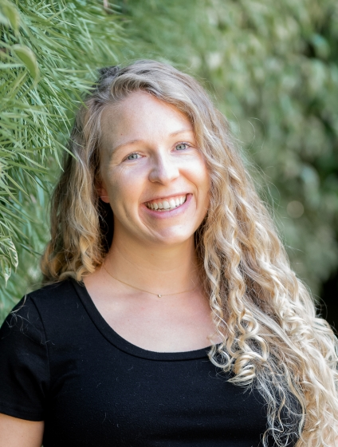
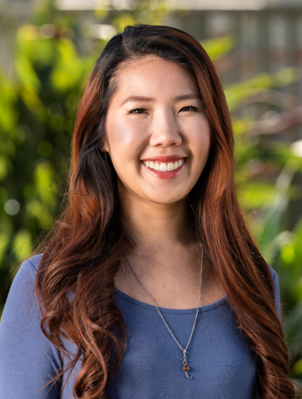
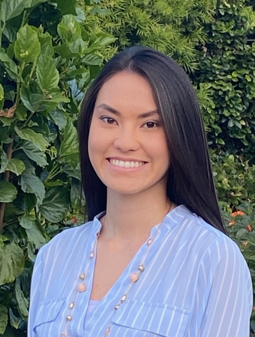

```{r setup, include=FALSE}
knitr::opts_chunk$set(echo = FALSE)
```

With less than four months until orientation for our first ever cohort of [Master of Environmental Data Science](https://bren.ucsb.edu/masters-programs/master-environmental-data-science) students, we're full speed ahead with MEDS! Covid-19 has changed how we work together (so much Zoom), but hasn't lessened how much love and energy we're putting into the program. Here's a little bit about what we've been up to.

## Building this website

Welcome to our MEDS website! We are building this website primarily as a place for our MEDS students to use as a resource for what's happening in the program. It will contain links to course websites, information about daily schedules, career workshop schedules, capstone project timelines, and more! 

We have big dreams for what this site will include - student blog posts! Interactive data visualizations! Capstone project highlights! Stay tuned as we build out the site with all things MEDS.

## Expanding the MEDS team

Since October we've been doing a LOT of building - building courses, building cohesion *across* courses, building websites, and even building new classrooms. So yeah...a lot happening around here. Thankfully, we've also been building our MEDS team, and have recently welcomed exciting new team members dedicated specifically to the MEDS program. 

### Jamie Montgomery - MEDS Program Coordinator 

<p>
  
In January we were thrilled to welcome our amazing MEDS Program Coordinator [Jamie Montgomery](https://www.jamiecmontgomery.com/), alum of the [Bren School Master of Environmental Science and Management](https://bren.ucsb.edu/masters-programs/master-environmental-science-and-management) program (Class of 2013), who for the past 8 years has been working as a Marine Data Scientist with the [National Center for Ecological Analysis and Synthesis (NCEAS)](https://www.nceas.ucsb.edu/). Whether leading the Ocean Health Index's US Northeast analysis, organizing (and teaching in) our world-famous [Eco-Data-Science](https://eco-data-science.github.io/) learning group, working to support diverse R-users through [R-Ladies Santa Barbara](https://twitter.com/RLadiesSB), or doing special projects like analyzing tweets to evaluate where locals versus tourists tend to visit in SB, Jamie is a leader in Santa Barbara and R data science communities. We are so lucky to have her leading our trailblazing MEDS program! 
</p>

### Kimberly Yom - MEDS Admissions & Student Affairs Coordinator

<p>
  
We also recently welcomed [Kimberly Yom](https://bren.ucsb.edu/people/kimberly-yom), our MEDS Admissions and Student Affairs Coordinator. Well, technically we welcomed her *back* to the Bren School - Kimberly previously worked at Bren as the MESM Academic Programs Assistant where she learned about Bren's collaborative, mission-driven focus! After working in contract administration for the UCSB Design & Construction department, she is back at Bren as the MEDS Admissions and Student Affairs Coordinator. We are really grateful to have a person with so much knowledge about the inner workings of both the Bren School and UCSB in this role in MEDS!

As the Admissions and Student Affairs Coordinator, Kimberly recruits admitted students, helps organize the admissions process, evaluates applications, and hosts meetings with prospective and admitted students to answer questions about the MEDS program and provide campus resources. Kimberly is "thrilled about the advent of the MEDS program as it supplies students with the data science skills needed to develop informed solutions to the world's complex environmental issues." For any questions regarding admissions or MEDS program logistics, she can be reached at kyom@bren.ucsb.edu.

</p>

### Miya Scheble - MEDS Career Development Program Manager

<p>
  
[Miya Scheble](https://bren.ucsb.edu/people/miya-scheble) joined the renowned Bren Career Team as the MEDS Career Development Program Manager. Prior to joining the Career Development team, Miya worked as a project coordinator and marketing assistant at a marketing, branding, and design company. She brings project management, customer relations, and marketing experience to Bren.

As the MEDS Career Development Program Manager, Miya oversees the day-to-day operations of the MEDS Career Development Program and helps students develop lifelong career skills that will help them secure desirable jobs and advance successfully throughout their entire career. With a background in environmental science and a strong interest in data science herself, Miya agrees with the NCEAS [statement](https://www.nceas.ucsb.edu/news/next-generation-environmental-scientists-are-data-scientists) that “the next generation of environmental scientists are data scientists.” Miya is “very excited to welcome the first cohort of MEDS students and support them throughout their career journeys.” For more information about career development and advising services at Bren, she can be reached at: miya@bren.ucsb.edu.

</p>

## NCEAS on the move

The National Center for Ecological Analysis & Synthesis (NCEAS), which will be hosting the program part time, is moving! NCEAS has been located on State Street in downtown Santa Barbara for over 25 years. This year NCEAS is moving just a couple blocks away to 1021 Anacapa Street. Before we move, and while we are all still working from home, the building is undergoing some renovations. The first floor of the building will host the MEDS program and will have a brand new classroom that holds 90 students. In addition there will be a student lounge, private meeting room, kitchen, and dedicated work stations. We are so excited about this brand new space for our students, keep an eye out for pictures of the new space in July!


