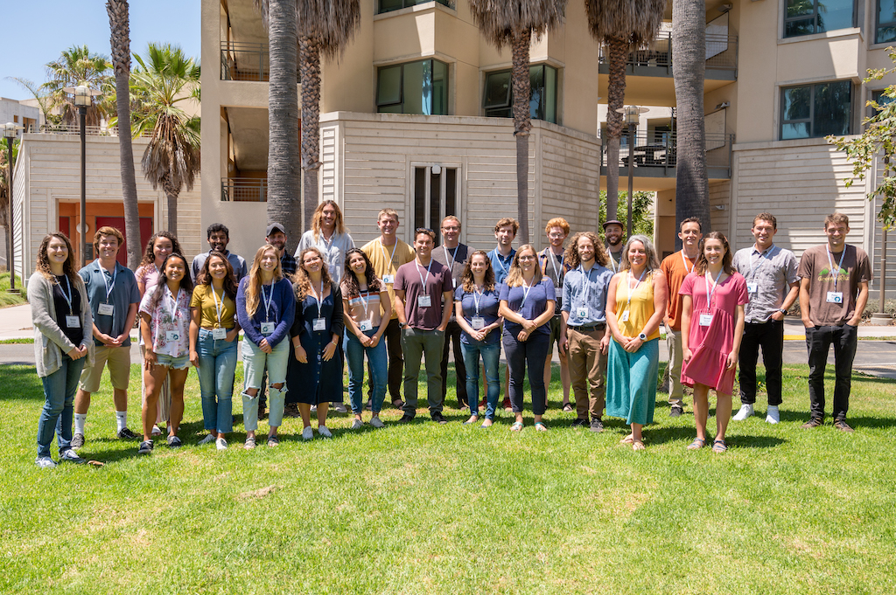
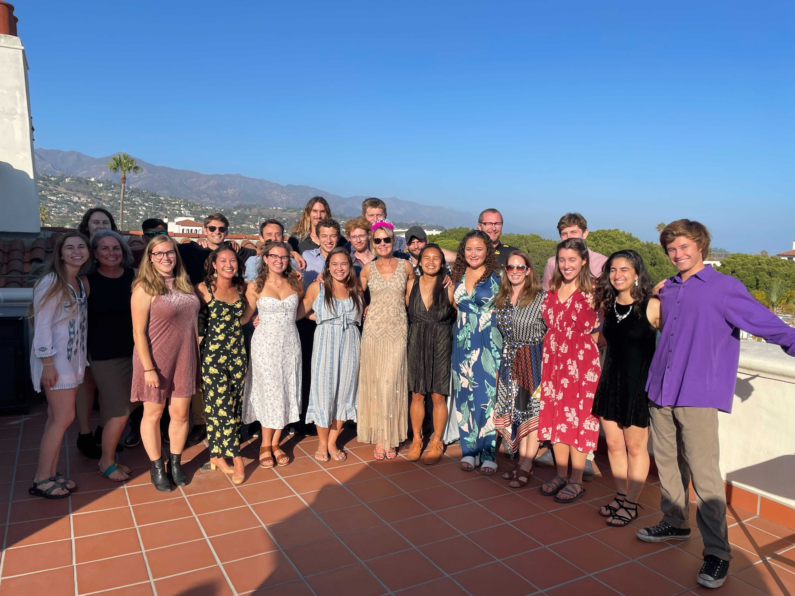
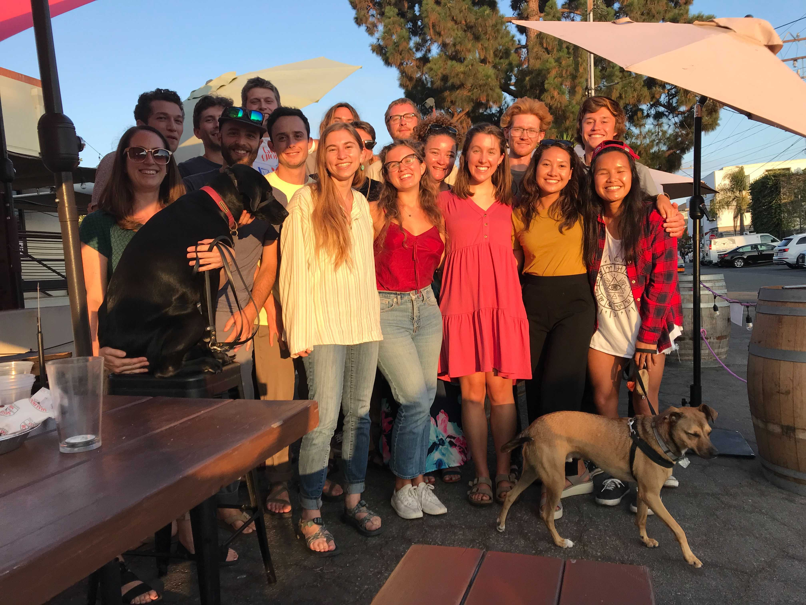

```{r setup, include=FALSE, collapse = TRUE}
knitr::opts_chunk$set(echo = TRUE, warning = FALSE, message = FALSE)
```

Hi there! This post is coming to you from Juliet Cohen and Scout Leonard! We are both students at UCSB’s Bren School of Environmental Science & Management in the inaugural cohort of the [Masters of Environmental Data Science (MEDS) Program](https://bren.ucsb.edu/masters-programs/master-environmental-data-science). 

## About us

Scout is interested in growing as an environmental data scientist after having worked with large datasets through food system and food security work in Oakland, California. Already, she is so pleased with the emphasis her MEDS courses have placed on *responsible* data science, as she hopes to use her MEDS toolkit to influence food security and resource use policy that builds sustainable, equitable food systems. You can learn more about her previous and ongoing work at her website: [scoutcleonard.github.io](https://scoutcleonard.github.io/). 

Juliet is interested in applying environmental data science to wildlife biology and the interaction between humans and endangered species’ natural habitats. Juliet was inspired by her experience serving as a field technician in California and Hawaii. Throughout the MEDS summer curriculum, Juliet strengthened her collaborative programming skills and looks forward to learning about spatial analysis and modeling large, dynamic data sets. She hopes to contribute to open-source projects in the future.

## MEDS Summer Session

For the first 6 weeks of our degree, we embarked on a whirlwind introduction to data science. From 9 AM to 5 PM we sat in the newly constructed MEDS classroom at the [National Center for Ecological Analysis and Synthesis (NCEAS)](https://www.nceas.ucsb.edu/) in downtown Santa Barbara, learning the basics to jumpstart our data science degrees. These week-long classes consisted not only of lectures, but oalso coding labs, collaborative team science projects, individual and group presentations. We also had “flex sessions” for non-course content, like panels from various data scientists at NCEAS and representatives from local groups of R users, such as [Santa Barbara R Ladies](https://www.meetup.com/rladies-santa-barbara/) and [EcoDataScience](https://eco-data-science.github.io/). Our summer term laid the foundation not only for the code we’ll write this year, but also for how we create workflows and collaborate as budding environmental data scientists. These courses included: 

- EDS 212: Essential Math in Environmental Data Science
- EDS 221: Scientific Programming Essentials
- EDS 214: Analytical Workflows and Scientific Reproducibility
- EDS 215: Introduction to Data Storage and Management
- EDS 216: Meta-Analysis and Systematic Reviews

After this intense MEDS summer we took some time to relax before fall quarter, but we also took this blog-post-writing opportunity to showcase some of what our class has learned so far. 

As we reflected on the first quarter of our degree, we decided it may be more interesting to show, rather than tell, some of the skills we’ve learned. We also thought it might be fun to share reflections from our whole cohort to truly represent the student experience of this fast-paced, learning-filled summer.

## What did MEDS students think about summer courses?

### Survey Development

We developed a Google Form survey for our classmates to gather data about their perspectives on these first six weeks. We had two main questions: 

1) what did the cohort think of our classes?   
2) what kinds of fun things has the group been up to in our delightful home of Santa Barbara? 

Our questions were developed with data tidying and visualization in mind and when we got some unexpected answers, we developed perspective about how our survey could have been better to help us with a bit less wrangling. MEDS students, however, do not shy away from problematic data, so we persisted with the problems that arose :)

### Analysis

The following is a step-by-step description of how we wrangled and visualized the most interesting survey responses including neat graphics describing our MEDS summer, from tidying data to surfing after class. We hope you find it insightful, but also fun :) 

#### Our Data

```{r, results=FALSE, message = FALSE, warning = FALSE}

#load libraries
library(tidyverse)
library(dplyr)
library(janitor)
library(here)
library(wordcloud)
library(RColorBrewer)
library(patchwork)
library(ggwordcloud)
library(paletteer)
```

First, we read the data from our Google form survey, which we were able to download as a .csv file, into the R project we made for this blog project. 

```{r}
data <- read_csv("data/MEDS Summer Reflection Survey (Responses) - Responses Clean.csv")
```

#### Data Tidying

Next, we renamed the columns. Google forms does this frustrating, but understandable thing where the names of the columns of data are the questions we asked participants. This makes for super long names that are not fun to write code with. We instead named the columns of interest with the corresponding order of our coursework, i.e. column 1 is our first course, EDS 212. 

```{r}
#colnames(data) renames the columns

data_clean <- data %>% 
  rename("1" =  "Write 3 words to describe or represent week 1 (EDS212 w/ Allison) here:") %>% 
  rename("2_3" =  "Write 3 words to describe or represent weeks 2 & 3 (EDS221 w/ Allison) here:") %>% 
  rename("4" =  "Write 3 words to describe or represent week 4 (EDS214 w/ Julien) here:") %>% 
  rename("5" =  "Write 3 words to describe or represent week 5 (EDS215 w/ Frew) here:") %>% 
  rename("6" =  "Write 3 words to describe or represent week 1 (EDS216 w/ Scott) here:")
```

#### Data Wrangling
The Google form format included five questions (one for each summer course) where students wrote in three words to describe how they felt about the course. In the .csv of the survey data, the three words submitted by a participant were grouped together in one cell per course. 

To visualize how often certain descriptors for each summer course appear, we first needed to separate the three terms submitted for each course into separate observations. We executed this using the `separate_rows()` function. This expanded the terms into three separate observations per student in each class column. 

```{r}
# separate the columns into rows by parsing the 3 words in each observation into 3 different observations
# select certain cols because our first data viz is only using certain cols 
data_clean_1 <- data_clean %>% 
  separate_rows("1") %>% 
  select("Email Address","1")

data_clean_2_3 <- data_clean %>% 
  separate_rows("2_3")%>% 
  select("Email Address","2_3")

data_clean_4 <- data_clean %>% 
  separate_rows("4") %>% 
  select("Email Address","4")

data_clean_5 <- data_clean %>% 
  separate_rows("5") %>% 
  select("Email Address","5")

data_clean_6 <- data_clean %>% 
  separate_rows("6") %>% 
  select("Email Address","6")
```

Then, to observe the frequency of words used to describe each course, we used the `table` function. This creates a table that has two columns: one for each distint descriptive word students used and the frequency with which the words occur for the class. Then, we converted that table to a data frame. 

```{r}
# use the table() function to take counts of each "factor" (words) and use the data.frame() function to convert these tables to data frames

course_1 <- data.frame(table(data_clean_1$"1"))

course_1_df <- as.data.frame.matrix(course_1)

course_2_3 <- data.frame(table(data_clean_2_3$"2_3"))

course_2_3_df <- as.data.frame.matrix(course_2_3)

course_4 <- data.frame(table(data_clean_4$"4"))

course_4_df <- as.data.frame.matrix(course_4)

course_5 <- data.frame(table(data_clean_5$"5"))

course_5_df <- as.data.frame.matrix(course_5) %>% 
  filter(!Var1 == "tangent") %>% 
  filter(!Var1 == "tangents") %>% 
  filter(!Var1 == "dry")

course_6 <- data.frame(table(data_clean_6$"6"))

course_6_df <- as.data.frame.matrix(course_6)
```


#### Data Visualizing
After this, we wanted to **visualize** the frequency of words for each class. We used ggplot to create word clouds which represented the frequency of class descriptors. The word clouds display the descriptive words submitted by our classmates in sizes proportional to the frequency the words were used. The ggplot plot we used is called `ggwordcloud`. We updated the colors by adding an aesthetic feature where each class descriptor is represented by a different color. We also updated the word size so that the cloud was easier to read. 

Since we used `ggplot` quite a bit in EDS 221, we opted for this method for generating word clouds over another package called `wordcloud,` which is specifically for word clouds. We found that we wanted to showcase our visualization skills by stacking visualizations and adding titles and colors, and it was easier to do this in a ggplot version of word clouds, since we had so much practice with other plots in ggplot.

The code chunk below is where we tried the `wordcloud` package. It made the correct visualizations, but we found it more difficult to make them as nice as some of the ggplots we made in class. It was a relief to learn that there is a word cloud feature in `ggplot`!
```{r, include = FALSE}
# make the clouds as separate graphs

#cloud_1 <- wordcloud(course_1_df$Var1, course_1$Freq, min.freq = 1, main = "Week 1 EDS 212:Essential Math in Environmental Data Science ")

#cloud_2 <- wordcloud(course_2_df$Var1, course_2$Freq, min.freq = 1, main = "Week 1 EDS 221")

#could_3_4 <- wordcloud(course_3_4_df$Var1, course_3_4$Freq, min.freq = 1)

#cloud_5 <- wordcloud(course_5_df$Var1, course_5$Freq, min.freq = 1)

#cloud_6 <- wordcloud(course_6_df$Var1, course_6$Freq, min.freq = 1)
```


And finally, the `ggplot` word clouds! 
  
```{r}

# for each cloud, specify the background color within the theme to match the background color of the blog This same code was repeated for all word clouds.

cloud_1 <- ggplot(course_1_df, aes(label = Var1, size = Freq, color = Var1)) +
  geom_text_wordcloud() +
  scale_size_area(max_size = 25) +
  theme(plot.title = element_text(size = 25),
        panel.background = element_rect(fill = "white")) +
  labs(title = "Week 1 EDS 212: Essential Math in Environmental Data Science")
```

```{r, echo = FALSE}
#code for each word cloud, brought this into this code chunk to hide the repeating code
cloud_2_3 <- ggplot(course_2_3_df, aes(label = Var1, size = Freq, color = Var1)) +
  geom_text_wordcloud() +
  scale_size_area(max_size = 20) +
  theme(plot.title = element_text(size = 25),
        panel.background = element_rect(fill = "white")) +
  labs(title = "Weeks 2 & 3 EDS 221: Scientific Programming Essentials")

cloud_4 <- ggplot(course_4_df, aes(label = Var1, size = Freq, color = Var1)) +
  geom_text_wordcloud() +
  scale_size_area(max_size = 20) +
  theme(plot.title = element_text(size = 25),
        panel.background = element_rect(fill = "white")) +
  labs(title = "Week 4 EDS 214: Analytical Workflows and Scientific Reproducibility")

cloud_5 <- ggplot(course_5_df, aes(label = Var1, size = Freq, color = Var1)) +
  geom_text_wordcloud() +
  scale_size_area(max_size = 20) +
  theme(plot.title = element_text(size = 25),
        panel.background = element_rect(fill = "white")) +
  labs(title = "Week 5 EDS 215: Introduction to Data Storage and Management")


cloud_6 <- ggplot(course_6_df, aes(label = Var1, size = Freq, color = Var1)) +
  geom_text_wordcloud() +
  scale_size_area(max_size = 20) +
  theme(plot.title = element_text(size = 25),
        panel.background = element_rect(fill = "white")) +
  labs(title = "Week 6 EDS 216: Meta-Analysis and Systematic Reviews")
```


```{r, fig.width = 15, fig.height = 34}
# use patchwork to stack the graphs

cloud_1 / cloud_2_3 / cloud_4 / cloud_5 / cloud_6
```

-----

## What do MEDS students do outside of class?

Our full-day classes kept us busy during the week, but since they were designed without additional assignments outside of class we were able to take advantage of our evenings and weekends. The most popular activities were surfing, going to the beach, and biking.

```{r, fig.alt="Histogram representing the MEDS students' favorite activities in Santa Barbara."}

# download cvs for SB activities
data_activities <- read_csv("data/sb_activities_data.csv")

# make data.frame for SB activities histogram

activities_clean <- data.frame(table(data_activities$"sb_activities"))

SB_activities <- ggplot(activities_clean, aes(y = reorder(Var1, +Freq), x = Freq)) +
  geom_histogram(stat = 'identity', aes(fill = Var1, color = "blue")) +
  scale_fill_paletteer_d("dutchmasters::milkmaid") +
  theme(legend.position = "none",
        panel.grid = element_blank(),
        panel.background = element_rect(fill = "white")) +
  labs(title = "MEDS Favorite Santa Barbara Activities",
       y = "Activity",
       x = "Total Votes")

SB_activities

```

-----

## What are the MEDS students excited for in Fall quarter?

> "Expanding my coding fundamentals, tidy Tuesday’s, building a portfolio and updating my website, and working collaboratively on the capstone project."

> "I’m excited to build on the foundation we created this summer!"

> "Excited to work with some spatial data in Frew's next class!"

> "I’m looking forward to learning more skills in data science and be able to apply them to assignments and projects in our classes. I’m also looking forward to learning more about potential future careers in environmental data science."

-----

## Meet the MEDS cohort!


**Class photo on our first day of Orientation at Bren Hall**


**The MEDS 2022 cohort gathered at NCEAS after class during summer session.**


**Members of the MEDS cohort in downtown Santa Barbara celebrating completing the first half of summer session classes with faculty and their pets.**


