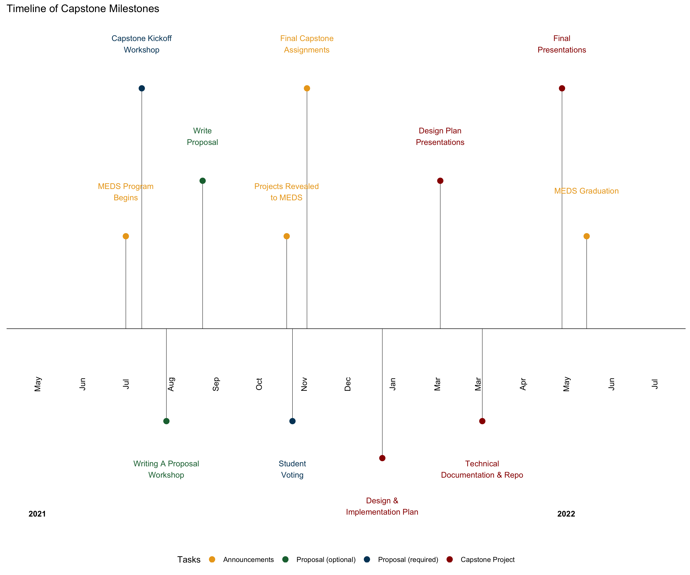

```{r setup, include=FALSE}
knitr::opts_chunk$set(echo = FALSE)

library(tidyverse)
library(gt)
```

Hello! We are [Halina](https://hdolinh.github.io/) and [Clarissa](https://cboyajian.github.io/), students at the University of California, Santa Barbara in the Bren School's [Masters of Environmental Data Science (MEDS)](https://bren.ucsb.edu/masters-programs/master-environmental-data-science) inaugural 2022 cohort.

## About us

Halina has a BA in Environmental Studies & Biology from UC Santa Cruz and has experience in field research, outdoor education, environmental advocacy, and waste. While working in Los Angeles, she recognized data inaccuracies in representation and in metrics. Halina is excited to apply her data science training to address these gaps and to find equitable solutions for environmental issues affecting urban watersheds.

Clarissa holds a BA in Urban and Environmental Policy from Occidental College in Los Angeles, CA. She has experience with volunteer management and education, grant writing, and nonprofit management. In her 5+ years in the Los Angeles urban forestry sphere, she experienced a lack of data collection and analysis to guide program and policy decisions. She is excited to bring her data science training to collaborative work that creates equitable connections between people and the developed and wild environments.

## MEDS Capstone Project 101

The [MEDS capstone project](https://bren.ucsb.edu/masters-programs/master-environmental-data-science/meds-capstone-projects) is a collaborative team experience where students use data to design, develop, and share a deliverable to help a client address an environmental issue. For the 2021-2022 academic year, all clients for capstone projects are UCSB affiliated, but in future years anyone will be able to propose a project. Projects that are chosen by the Capstone Committee get a team of 3-4 students from January to June 2022 (roughly 1 full-time staff for 6-months). All projects need to be product-oriented, have access to necessary data, be fully funded, have an environmental justice aspect, and have a clearly defined scope. Check out more in the timeline below!

{width=100%}

## Our proposal and capstone

We were co-authors on the proposal, *Ensuring equitable access to outdoor recreation: Evaluating spatiotemporal patterns and trends in campground use on federal public lands.* This proposal was chosen as one of the final capstone projects for 2022. It will combine data from the [Recreation Information Database (RIDB)](https://ridb.recreation.gov/landing) and [U.S. Census Data](https://data.census.gov/cedsci/) to create a tool that visually represents our analysis of access to federal lands. There is a growing need to understand and mitigate inequities in access to outdoor recreation, especially since outdoor recreation provides critical health and well-being benefits to communities. This proposal aligned closely with our interests, as we both have experience working directly with communities and the environment. Our primary deliverable is to create an interactive platform using the [R Package, Shiny](https://shiny.rstudio.com/). The app will summarize and visualize park-specific patterns and trends in visitation volume, demand, and visitors' location of origin.

Major shout out to [Kaitlyn Gaynor](http://www.kaitlyngaynor.com/) and [Will Rice](https://www.willrice.us/) for all their support and guidance on our proposal!


## Other capstones for the 2022 cohort

1. Assessing Potential Environmental Justice Implications of Environmental Pressures from the Global Food System

2. Snow Today: Delivering impactful information on snow cover and albedo to diverse global users through web based big data visualizations

3. A web‐based application for visualizing spatial and temporal patterns of anthropogenic stressors on coral reefs in the lagoons of Moorea, French Polynesia

4. Renewable Energy Siting Predictors Observed from National Data for Wind and Solar (RESPOND Wind and Solar)

5. Understanding Climate Change’s Impact on the Forest Ecosystem: Developing a Reproducible Machine Learning Approach to Ecohydrologic Model Output

6. An open-source pipeline for remote sensing of crop yields under environmental change in Sub-Saharan Africa


## Tips, thoughts, and recommendations

Now that our proposal has been submitted (and selected!), we've taken some time to reflect on the proposal process. There's a lot we've learned and we've compiled our most essential thoughts below.

### Why you should write a proposal (even if you think you shouldn't or can't)

We won't deny that writing a proposal can be a daunting task -- it takes time and work -- but we think it's a worthwhile process. Even if the proposal deadline is two weeks away while you're reading this, we encourage you to write a proposal! See if these reasons can convince you:

-   You will hear this plenty at Bren (if you haven't already), but **networking** is a crucial part of your grad school experience. This includes networking with your cohort! Your cohort will be some of your strongest connections after you graduate, and working on a capstone proposal is a great opportunity to build those connections early. Beyond your cohort, working on a proposal with a client gives you many excellent opportunities to network with potential employers (or someone who can connect you to potential employers).

-   The MEDS program is a professional-degree program and is all about preparing you for a career to solve environmental problems using data science. The capstone proposal is one of the first opportunities to use what you're learning. It's a moment to practice several professional skills like project management, communication, research, proposal writing and data exploration. This means this is **a real-life experience that you can put on your resume.** We found this to be crucial for us since our backgrounds include less technical data experiences and we want to be able to graduate with both a degree *and* relevant experience.

-   Our primary motivation to write a capstone proposal was because **we care about the topic**. We deeply care about environmental justice, and while we aren't 100% sure what this looks like for our data science futures, we know we want careers that involve people and how they interact with the environment. So when we saw a proposal idea focused on studying spatiotemporal patterns of visitors in National Parks we both instantly wanted to know more. Writing a proposal gave us the **opportunity to dive into a topic we were interested in**. This made writing the proposal less of a daunting task since we were internally motivated. It also meant that we were more willing to challenge ourselves because we personally care about the outcome of the proposal.

### Most Helpful Resources

- Each other! After the first few weeks of summer, you and your cohort will have already spent at least 40 hrs a week with each other. Meaning - there's a good chance you'll have at least a basic understanding of everyone's interests (also you may not have an interest yet, or maybe your interests are only vague ideas - that's okay!). Anyway, what we are trying to say is find who in your cohort has similar interests to you. Because writing a proposal together makes the whole task less daunting. This allows you to split up the work, lean on each other for support, and discuss when you feel uncertain.

- We approached our client the second week of the summer and started brainstorming ideas soon after. By starting early, this gave us time to really sit with the information, the data, and the overall question we wanted to answer. When it comes to writing a proposal, **time to sit and reflect about your proposal idea is part of the process.**

- Not sure where to start your research? Have too many topics you're interested in? Talk to a librarian! Each department at UCSB has their own dedicated librarian. Check out the [Subject Guides webpage](https://guides.library.ucsb.edu/) on the library's website for resources and contact information to subject experts. You might also want to check out the [Zotero Workshop](https://guides.library.ucsb.edu/zotero-workshop/home) so you can start organizing your background research right away. 

- Something else you've probably heard is **don't reinvent the wheel**. Many functions and solutions you need already exist thanks to the many amazing and talented individuals within the data science field. The same goes for project proposals. If you're getting writer's block, look at the [Master's Project Directory on the Bren website](https://bren.ucsb.edu/projects) to see proposals from previous years for inspiration (Bren students have been doing capstone projects since 1999). 

- If you haven't written in awhile...talk to professors or students in the [Communications Focus](https://bren.ucsb.edu/masters-programs/master-environmental-science-and-management/academics-mesm/communication-focus)! They know how important writing skills are and want you to succeed. Some helpful readings to check out are:  
  - [On the Art of Writing Proposals by Adam Pzreworski and Frank Salomon](https://www.ssrc.org/publications/the-art-of-writing-proposals/). This is a pretty quick read - only 9 pages!
  - [Research Design: Qualitative, Quantitative, and Mixed Methods Approaches by John W. Creswell](https://www.ucg.ac.me/skladiste/blog_609332/objava_105202/fajlovi/Creswell.pdf). Skip to Chapter Two: Review of the Literature.

### The "hardest" parts of the process

Writing a proposal is doable and we're *all* capable of writing one. For us, describing the work *before* we’ve learned how to do it was the most overwhelming part of the process. But you're not alone! That's where the clients for our project came into play. They were able to put into technical terms our ideas and excitement for the project. Don't be afraid to be upfront with what you don't know yet.


### How to consider an Environmental Justice lens in your proposal (and beyond)

Environmental Justice (EJ) has multiple definitions that changes with context. One framework we'd like to share with you is [intersectional environmentalism](https://www.intersectionalenvironmentalist.com/), coined by [Leah Thomas](https://www.greengirlleah.com/). Intersectional environmentalism focuses on the interconnections between injustices that harm people (especially frontline communities or those who have been historically discriminated against) and the environment. This is a crucial lens to maintain while you are writing your proposal because **the solutions we write about are not solutions unless it works for everyone involved**. We have found this lens to be challenging at times because it forces us to think differently and tests assumptions we've grown up with, but ultimately it makes us better data scientists. 

Here are some EJ themes and questions to think about while writing your proposal. These questions use **Justice Analysis** to identify environmental injustices and come from Bren's Equity and the Environment course (highly recommend taking).

#### Power

- Who has the power in the situation? Who has privilege? How does power and privilege play into communication, representation, access to resources, or decision-making?

#### Distribution of Harm
 
- Who is receiving the brunt of the suffering or harm in the situation? 

#### Anthropocentrism / Species-ism

- What aspects of the environment are being systematically overlooked and why? How is excessive self-centeredness playing into this - on the part of the humans? What can we do to overcome it? 

#### Racism & Xenophobia
 
- How is this factoring into the situation? Does someone have less power or privilege because of their race or ethnicity? 

#### Ways of Knowing
 
- Whose 'way of knowing' are privileged? Is there a type of evidence or data that is privileged over others? Is the worldview of the dominant group causing harm? 
 
#### Exclusionary Solutions
 
- Does what is offered make sense for all potential parties involved? Is the solution reasonable and accessible? 

#### Burden of Evidence

- Who is responsible for showing there is environmental harm? Is this appropriate? What would an alternative be?


## It's only week 1 of Winter quarter and we're just getting started! Come back for more Capstone updates over the next 6 months.


