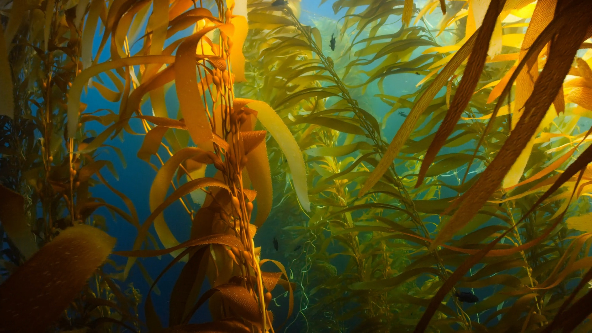

<center>***This article is cross-posted from the NCEAS [News & Features](https://www.nceas.ucsb.edu/news) blog.***</center>

<br>

```{r, eval=TRUE, echo=FALSE,fig.align='center', out.width="85%", fig.alt="A group of MEDS students stand in two rows smiling at the camera. Behind them is a large red statue of a fish and palm trees all around."}

```

<center><span style="color: gray;">A group photo of the MEDS 2022-2023 cohort outside the UCSB Bren School on the day of their final capstone presentations to the public.</span></center>

<br>

The next generation of environmental scientists are data scientists – a sentiment that NCEAS and the UCSB Bren School recognized when they founded the Masters of Environmental Data Science program in 2021. Our second cohort of 31 MEDS students just graduated and ready to tackle new environmental data science challenges. To mark the end of their accelerated, 11 month education, students presented their Capstone Projects to the public on June 2, 2023. These projects highlighted data driven solutions to environmental problems for clients spanning academia, industry, non-profit, and government. 

A short synopsis of all eight Capstone Projects are below. According to Naomi Tague, Bren School Professor and MEDS Capstone advisor, “It’s not just that these students have learned a bunch of environmental data science techniques, they’ve also learned to deal with stakeholders, to think about messy data and their clients’ needs. They learn project management while also thinking deeply about environmental problems.” As she summarized: “I feel really good about year two of our MEDS program.”

## In the quest for renewable energy, combine solar with wind

The United States has set a lofty goal: completely carbon free energy by 2035. Solar is a promising stepping stone, but installing panels across the country comes at a cost – to the taxpayer and the environment – in the form of ecological impact, specialized infrastructure, and expensive updates to the electrical grid. In their capstone project, Michelle Lam, Colleen McCamy and Alessandra Vidal Meza explored a cost-saving, low-impact alternative: co-location. The idea is to add solar panels to existing wind farms, minimizing the pressures to develop land and upgrade infrastructure. Plus, these forms of energy make an ideal “power couple”: windmills reach maximum production at night while solar panels often perform best at peak sunshine in mid-day. For their client, [UCSB Environmental Studies'](https://es.ucsb.edu/) Dr. Grace Wu, this team calculated potential profits and energy production across possible locations for co-location efforts. They also considered tax incentives and equity, factoring in recent Inflation Reduction Act credits and socioeconomic status. They delivered an [interactive map](https://gracewu.shinyapps.io/colocation-findings/) to explore the nearly 115 GW of potential solar energy generated from co-location to their client. That’s enough power to run over 19 million U.S. homes. And while this energy is not enough to reach the 2035 goal, group member McCamy notes that it's still an important step: “It’s not a huge portion, but energy from co-location is low hanging fruit towards our goals for a carbon-free electric future.”

```{r, eval=TRUE, echo=FALSE,fig.align='center', out.width="70%", fig.alt="Wind turbines standing in a field and the sun setting in the background."}

```

## Uncovering hidden emissions in American steel production

The United States needs more steel to keep up with demand for new cars, bridges, buildings, and more. With steel production accounting for 11% of global carbon dioxide emissions, environmentalists are left wondering: how will this expanding industry decarbonize? As a hopeful leader in green energy, the US is already taking steps, with 70% of steel plants powered by electricity instead of coal. This minimizes direct greenhouse gas releases (called Scope 1 emissions), but plants still have environmental impacts from electricity use. For their capstone, Erica Bishop, Ruth Enriquez, Amrit Sandhu, and Michael Zargari quantified these nebulous, under-reported, indirect impacts, also called “Scope 2 emissions,” for their client [Global Energy Monitor](https://globalenergymonitor.org/). They produced an [interactive Tableau dashboard](https://public.tableau.com/app/profile/steel.tracker) to visualize direct and indirect emissions for each plant. Surprisingly, the size of the steel plant was not the biggest driver in emissions intensity. Instead, smaller plants in certain regions had disproportionately high impacts because of their reliance on “dirtier” local grids. Project member Sandhu noted that “Most of the pollution is coming from the grid. Plants that can source their own electricity from renewables can decarbonize much easier.” The team’s deep dive in steel emissions also highlighted the need for transparent data around manufacturing. On the movement towards open science, Bishop stressed “As the US is making claims of sustainable steel production using recycled materials and clean electricity, it's essential that we have access to Scope 2 emissions data to assess those claims. Electrification is not inherently decarbonization. We need the data to make sure we’re moving in the right direction”

```{r, eval=TRUE, echo=FALSE,fig.align='center', out.width="70%", fig.alt="The dimly lit interior of a steel production plant."}

```

## Keeping up with kelp: Data and modeling for cultivation

Under the right conditions giant kelp grows quickly, stretching more than a foot a day to form the towering canopies characteristic of Southern California beaches. While many recognize these underwater forests for their benefits to fish and coastlines, kelp is also a promising biofuel given its capacity for rapid growth. In their capstone Erika Egg, Jessica French, Javier Patrón, and Elke Windschitl, teamed up to provide better kelp data for their two clients: UCSB’s [Interdepartmental Graduate Program in Marine Science](https://www.igpms.ucsb.edu/) and [Ocean Rainforest](https://www.oceanrainforest.com/). For UCSB, their goal was to synthesize existing environmental data, focusing on giant kelp in the Santa Barbara channel. As group member French mentioned “There’s a lot of data out there! The biggest challenge was bringing it all together in the same format.” By compiling 13 long-term data sets, they were able to provide UCSB researchers with up to date data on local kelp. Teammate Windschitl stressed the importance of this behind the scenes work, noting “Instead of juggling data set after data set, researchers now have a shortcut to get to their analysis. Faster research leads to better understanding of kelp and can better inform future restoration.” Indeed, their efforts allowed them to serve their second client. Ocean Rainforest recently received permission from the California Coastal Commission to launch an aquaculture project offshore of Santa Barbara, but were unsure of the exact ideal location. Using their compiled data and a species distribution model, the capstone team was able to deliver a list of coastal spots with the highest potential  kelp growth.

```{r, eval=TRUE, echo=FALSE,fig.align='center', out.width="70%", fig.alt="Peering through dense fronds of Giant Kelp, beneath the water."}

```

## Enhancing enforcement of marine protected areas

Marine protected areas (MPAs) have been enacted around the world to prioritize ocean conservation. With almost 15,000 global MPAs, approximately 7% of the ocean is protected – that’s over 10 million square miles, which is roughly 3 times the size of the United States. Unlike enforcement on land, it’s notoriously tricky to track compliance across this vast area at sea. That’s where [WildAid Marine](https://marine.wildaid.org/) comes in – they work with local leaders to improve MPA enforcement, monitoring sites on everything from numbers of patrol vessels to level of community involvement. In their capstone, Kiran Favre, Elise Gonzales, Jared Petry, and Adelaide Robinson worked with WildAid Marine to improve their data collection and visualization workflow. Robinson noted that when their client approached them, “they had an existing system, but it was spread across many excel spreadsheets and relied on a time consuming process that led to accidental errors.” The capstone team recrafted their system, creating two online password protected portals that worked together to efficiently input data and then beautifully visualize it. As Petry put it, “The new system is going to give WildAid Marine more time to focus on their work, and less time to stress about their spreadsheets.” The group hopes that this enhanced workflow will allow WildAid to do what they do best, because, as Robinson summarized, “Without proper enforcement, MPAS are really only protected in name.”

```{r, eval=TRUE, echo=FALSE,fig.align='center', out.width="70%", fig.alt="A photo taken half above the ocean surface, with a tropical island in the distance, and half below the ocean surface, with coral on the shallow sea floor."}

```

## For California fires, groundtruth models with groundwater

Ask any Californian about wildfire and they will tell you: it’s getting worse, not better. The data agree, showing that fire severity has sharply increased over the last decade. Wildfire models allow state policymakers to make informed decisions about management actions like controlled burns or community resilience plans. According to Jillian Allison, Meagan Brown, Andre Dextre, and Wade Sedgwick, however, these models are missing something important: groundwater. Their client, [The Nature Conservancy](https://www.nature.org/en-us/), agreed, requesting a data science driven tool to visualize the dynamic relationship between groundwater ecosystems and wildfire. After compiling existing data, the capstone team created an [online dashboard](https://shinyapps.bren.ucsb.edu/aquafire/) that showed fire severity, burn perimeters, and occurrence history across California’s 13 ecoregions. In the coastal chaparral here in Santa Barbara, for example, the team found that groundwater did not seem to mitigate wildfire like it appeared to in forested areas near the Oregon border. Instead, they hypothesized that the lower soil moisture acted as a fuel, contributing to fire intensity in the region. On the future of fire models, project member Sedgwick noted “Wildfire risk models are inherently complex, relying on a lot of variables and data. Groundwater ecosystems are a relatively novel concept and we wanted to see if it was really worth it to include them. We see this as the first step in that worthwhile effort.” The group hopes that their efforts will be useful to non-profits and policymakers in California as they manage the next wave of wildfires under an ever-changing climate.

```{r, eval=TRUE, echo=FALSE,fig.align='center', out.width="70%", fig.alt="Wildfire smoke rises above dry and scorched mountaintops. Red fire retardant lines the ridgeline of the mountain in the foreground."}
knitr::include_graphics("groundwater.jpeg")
```

## Mind the gap: predicting agricultural data from space

Global food security is a looming threat – one that will only worsen under climate change. For lower income countries in Africa like Zambia, the UN has limited agricultural data to assess current and future food needs. Machine learning models have historically helped fill this gap, leveraging satellite data to infer agricultural conditions. However, these models are expensive to run, require supercomputer access, and, despite their complexity, deliver results that are extremely specific to their inputs. Enter a new method: “MOSAIKS” or Multi-task Observations using Satellite Imagery & Kitchen Sinks. MOSAIKS uses less training data, offers more generalizable results, and can even be run on a personal computer. For their capstone, Andrew Bartnik, Carlo Broderick, Gabrielle Smith, and Hailey Veirs, conducted a case study to test this improved approach for Zambia’s agricultural data gap. They hoped to broaden the scope of this model’s applications, building from a [2022 MEDS Capstone](https://bren.ucsb.edu/projects/open-source-pipeline-remote-sensing-crop-yields-zambia-case-study) for their clients: the [UCSB Bren School](https://bren.ucsb.edu/). Typically, machine learning models predict just one variable, for example crop yields, total harvest, or drought impacts. MOSAIKS predicted all three (plus 24 others) across Zambia with a single program run. “This is where MOSAIKS shines” explained group member Broderick. “Traditional models may do better on each individual variable, but it takes orders or magnitude more data, time, and money.” Indeed, the group hopes their case study demonstrates the power of this new approach for agricultural modeling, providing better data for decision makers in sub-saharan Africa. On its scope, teammate Bartnik noted “This could even be used to supplement early warning systems to help render aid to parts of the country that need it most.” 

```{r, eval=TRUE, echo=FALSE,fig.align='center', out.width="70%", fig.alt="A savannah with one tree in the foreground. Dark clouds hover over the right side of image, while sun rays shine down from the clear sky on the left."}

```

## Simulating scenarios for wildfires models and beyond

Fire season is coming in California – and with our hotter summers and drier winds, forecasts predict larger, more severe wildfires. Weather data is crucial for wildfire modeling, but for this capstone’s client, the [UC Disaster Resilience Network](https://ucdrn.org/), it’s always been a hot topic. To get inputs for wildfire predictions like humidity, wind, rain, or temperature, researchers rely on global climate models that predict each variable for a given day. According to project members Victoria Cutler, Erica Dale, Mallory Giesie and Lewis White, these coarse global models do not capture the complete spectrum of the day-to-day weather for a given region. To solve this issue for their client, the capstone team developed a process for creating a variety of climate scenarios — customizable and downloadable via an online interface — that can be used as inputs for predictive wildfire models. The big improvement? More data. As teammate Cutler described, “Before, we were essentially using global climate models to get one guess at weather information. Now, we are using the same model and running nearby years, essentially generating multiple guesses over and over again to get more accurate variation.” This also allowed the team to be intentional about different climate scenarios, for example pulling data from certain dry or wet years to simulate the effects of drought on wildfire risk. Dale noted that this method goes beyond wildfires. “It can be effectively used in modeling projects to investigate impacts of weather variables on different natural processes. For instance, rain can be used to assess the risk of flooding in urban regions. As long as something is impacted by weather conditions, it can be studied using this technique.”

```{r, eval=TRUE, echo=FALSE,fig.align='center', out.width="70%", fig.alt="A wildfire burns vegetation beneath a rocky mountain peak."}
knitr::include_graphics("wildfire.jpeg")
```

## Paraguay’s Paradox: Balancing forest conservation and cattle production

The Gran Chaco is the second largest forest in South America, spanning four countries, connecting seven ecosystem types, and hosting incredible biodiversity. But it’s also at risk of collapse, with one of the highest rates of deforestation on the planet. About one quarter of the Gran Chaco is in Paraguay, making up 60% of the country's total land area. Policymakers there face a difficult dilemma: should they maximize Gran Chaco conservation or give up forest lands for the growing cattle industry. As teammate Ayala summarized “Right now, Paraguay is at a crossroads.” To help their client, the [UCSB Environmental Studies Program](https://es.ucsb.edu/) and [Paraguay's National Forestry Institute (INFONA)](https://infona.gov.py/), the capstone group calculated how different policy options would impact deforestation. Current law requires that 25% of forest lands remain preserved for any proposed cattle production – but environmentalists are arguing that this is not enough. Atahualpa Ayala, Dalila Lara, Alex Reed, and Guillermo Romero modeled scenarios between 5 and 50% of land conservation and calculated the deforestation impact for the Paraguayan Gran Chaco. They created a private online dashboard for decision makers in Paraguay, highlighting different paths in the tradeoff between forest conservation and cattle ranching. As Reed summarized, “By democratizing data access, this project ensures that INFONA and policymakers are equipped to make well-informed decisions, leading the way towards a sustainable future in the Paraguayan Gran Chaco.”

```{r, eval=TRUE, echo=FALSE,fig.align='center', out.width="70%", fig.alt="Sun rays shine through trees standing in a field. A horse stands in the field."}

```
