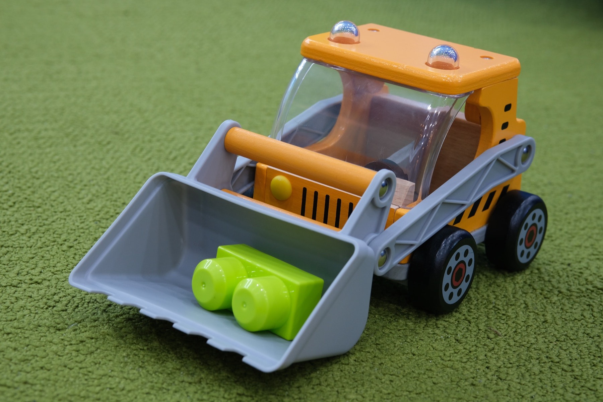

<h2><center>This page is under construction.</center></h2>

<p><center>For more information while we work on it, please visit the Bren School [MEDS Capstone Projects](https://bren.ucsb.edu/masters-programs/master-environmental-data-science/meds-capstone-projects) page.</center></p>

```{r, echo = FALSE, fig.align = "center", out.width = "60%"}



```

<p style="color:gray; font-size: 15px; style: italic;"><center><i>Photo: toy construction truck moving a building block, by <a href="https://unsplash.com/@renichinguyen?utm_source=unsplash&utm_medium=referral&utm_content=creditCopyText">Nguyen Bui</a> on <a href="https://unsplash.com/s/photos/toy-bulldozer?utm_source=unsplash&utm_medium=referral&utm_content=creditCopyText">Unsplash</a></i></center></p>


## Overview

All MEDS students will work in groups of 3-4 students to design, develop and share a deliverable that helps a client to gain insights, answer questions, and/or create communication materials using environmental data. 

## Goal

The goal of the MEDS Capstone is to help students build real-world data science and professional skills while working with a client to complete a project using environmental data. 


