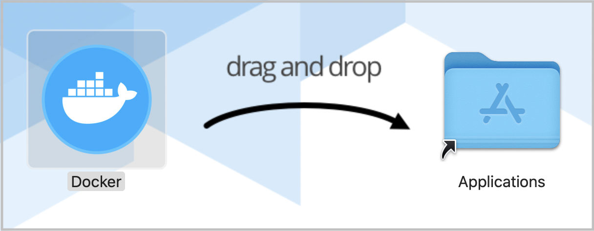

**Note:** There is an installation session during MEDS orientation to test and troubleshoot installations.

**Computing requirements:** See the [MEDS Computing Requirements](computer_reqs.html) for minimum device needs. If you do not have a device that meets the minimum requirements, we may be unable to help troubleshoot some installation issues. Please submit issues here. 

## Necessary software:

- R
- RStudio
- git (configured)
- GitHub account (with PAT setup)
- Anaconda
- Slack
- Docker

**Note:** All of these are free at the level you’ll need them at for MEDS. If you are asked to pay for something, you’re choosing the wrong option. 

<h4 align="center"> Choose your operating system: </h4>

<h2 align="center">[MacOS] | [Windows]</h2>


## MacOS

#### 1. Install or update R

To install R, visit [r-project.org](https://www.r-project.org/) to learn more, then choose a CRAN mirror (for example, the Oregon State University CRAN mirror) to download the most recent version of R for your operating system. You should have at least version 4.1.0 (released 2021-05-19) running when you start MEDS.

#### 2. Install or update RStudio

- **New install:** To install RStudio, visit [rstudio.com/products/rstudio/](https://www.rstudio.com/products/rstudio/). Download the free (“Open Source Edition”) Desktop version for your operating system. You should have at least version 1.4 (early 2021) installed to start MEDS. 

- **Update:** If you already have RStudio and need to update: Open RStudio, and under ‘Help’ in the top menu, choose ‘Check for updates.’ If you have the most recent release, it will return ‘No update available. You are running the most recent version of RStudio.’ Otherwise, you should follow the instructions to install an updated version.

- Open RStudio (logo you'll click on shown below): **If upon opening RStudio you are prompted to install Command Line Tools, do it.**

```{r, echo = FALSE, fig.out="10%", fig.align="center"}
knitr::include_graphics("img/install-guide-images/rstudio-logo.png")
```


- Note: you may need to install command line tools and XQuartz. 
   
  - To install command line tools (if you’re not automatically prompted), run in the Terminal tab in RStudio: `xcode-select --install` 
  - Visit [xquartz.org](https://www.xquartz.org/) to download & install XQuartz


#### 3. Check for git

You should already have git on your device, but let’s check for it anyway. 

- Open RStudio

- In the Terminal, run the following command:

    `which git`

- If after running that you get something that looks like a file path to git on your computer, then you have git installed. For example, that might return something like this (or it could differ a bit): `/usr/local/bin/git`. If you instead get no response at all, you should download & install git from here: [git-scm.com/downloads](https://git-scm.com/downloads)


#### 4. Create a GitHub account 

- If you don’t already have a GitHub account, go to github.com and create one. Here are helpful considerations for choosing a username: [happygitwithr.com/github-acct.html](https://happygitwithr.com/github-acct.html).

#### 5. Configure git

- In RStudio, open the Terminal. Run the following commands (by pressing Enter after each line), replacing the username (keep the quotation marks!) and email with your username and email used for your GitHub account. 

    `git config --global user.name "Jane Doe"`
    `git config --global user.email janedoe@example.com`

- Then, in the Terminal run the following, carefully checking that the name and email returned match your GitHub information: 

    `git config --list --global` 

#### 6. Store your GitHub personal access token (PAT)

- Once you have git configured successfully, install the `usethis` package in R by running the following in the RStudio Console: 

    `install.packages(“usethis”)`
    
A lot of scary looking red text will show up while this is installing - don’t panic. If you get to the end and see something like below (with no error) it’s installed successfully.

```{r, echo = FALSE, fig.out="60%", fig.align="center"}
knitr::include_graphics("img/install-guide-images/install-pkg-success.png")
```


- Run the following in the RStudio Console: 

    `usethis::create_github_token()`      

- Enter your GitHub password when prompted. You’ll be taken to a screen that looks like this, with reasonable options already selected for you: 

```{r, echo = FALSE, fig.out="60%", fig.align="center"}
knitr::include_graphics("img/install-guide-images/new-pat.png")
```

- Do not change anything. Just scroll down to the bottom of that page and click the green ‘Generate token’ button:

```{r, echo = FALSE, fig.out="80%", fig.align="center"}
knitr::include_graphics("img/install-guide-images/generate-token.png")
```

- Copy the generated PAT to your clipboard

- Back in RStudio, in the console run `gitcreds::gitcreds_set()`. This will prompt you to paste the PAT you just copied from GitHub. Paste the PAT, press Enter to run. You should see something like this show up if all is well so far (you’ll have pasted your PAT where mine says “REDACTED”): 

```{r, echo = FALSE, fig.out="40%", fig.align="center"}
knitr::include_graphics("img/install-guide-images/gitcreds-set.png")
```


- In the RStudio Console, run: 

    `usethis::git_sitrep()`

Does it return information about your connected GitHub account that looks something like below? Great! You’ve configured git and successfully stored your PAT. 

```{r, echo = FALSE, fig.out="50%", fig.align="center"}
knitr::include_graphics("img/install-guide-images/git_sitrep.png")
```


#### 7. Install Anaconda

- [Click here to download 64-bit Graphical Installer](https://repo.anaconda.com/archive/Anaconda3-2021.05-MacOSX-x86_64.pkg). This might pop open a new tab with a “redirecting you to…” phrase, but Anaconda should be downloading at the same time. It might take a couple minutes. After it’s downloaded, click it and hit Allow if you see the following:

```{r, echo = FALSE, fig.out="20%", fig.align="center"}
knitr::include_graphics("img/install-guide-images/allow-program.png")
```


Follow the installation steps to complete Anaconda installation.

#### 8. Create your Slack account and join MEDS 

- Click [here](https://join.slack.com/t/ucsb-meds/shared_invite/zt-so8oh7xf-w41bSnbBWAiMOXKPf5j_qw) to join our UCSB-MEDS Slack Workspace

- Customize your profile with your name and photo.

- Join the summer course channels (#eds-212, #eds-221, #eds-214)

- Read through the [Slack Resource Guide](https://ucsb-meds.github.io/meds-slack.html)


#### 9. Install Docker

- Visit [docker.com/get-started](https://www.docker.com/get-started) and install Docker Desktop for your operating system. **Note: If you have a Mac, you must select either the Intel Chip or the more recent computers will have the Apple chip.** Once installed, drag & drop into Applications.


```{r, echo = FALSE, fig.out="50%", fig.align="center"}

```


## Windows

#### 1. Install or update R
To install R, visit [r-project.org](https://www.r-project.org/) to learn more, then choose a CRAN mirror (for example, the Oregon State University CRAN mirror) to download the most recent version of R for your operating system. You should have at least version 4.1.0 (released 2021-05-19) running when you start MEDS.


#### 2. Install or update RStudio

- New install: To install RStudio, visit [rstudio.com/products/rstudio/](https://www.rstudio.com/products/rstudio/). Download the free Desktop version for your operating system. You should have at least version 1.4 (early 2021) installed to start MEDS. 

- Update: If you already have RStudio and need to update: Open RStudio, and under ‘Help’ in the top menu, choose ‘Check for updates.’ If you have the most recent release, it will return ‘No update available. You are running the most recent version of RStudio.’ Otherwise, you should follow the instructions to install an updated version.

- Open RStudio (logo you'll click on shown below). **If you are prompted to install Command Line Tools, do it.**

```{r, echo = FALSE, fig.out="25%", fig.align="center"}
knitr::include_graphics("img/install-guide-images/rstudio-logo.png")
```


#### 3. Check for git

You should already have git on your device, but let’s check for it anyway. 

- Open RStudio  

- In the Terminal, run the following command:

    `where git`

- If after running that you get something that looks like a file path to git on your computer, then you have git installed. For example, that might return something like this (or it could differ a bit): `/usr/local/bin/git`. If you instead get no response at all, you should download & install git from here: [git-scm.com/downloads](https://git-scm.com/downloads)

#### 4. Create a GitHub account 

- If you don’t already have a GitHub account, go to github.com and create one. Here are helpful considerations for choosing a username: [happygitwithr.com/github-acct.html](https://happygitwithr.com/github-acct.html).

#### 5. Configure git

- In RStudio, open the Terminal. Run the following commands (by pressing Enter after each line), replacing the username (keep the quotation marks!) and email with your username and email used for your GitHub account. 

    `git config --global user.name "Jane Doe"`
    `git config --global user.email janedoe@example.com`

- Then, in the Terminal run the following, carefully checking that the name and email returned match your GitHub information: 

    `git config --list --global` 

#### 6. Store your GitHub personal access token (PAT)

- Once you have git configured successfully, install the `usethis` package in R by running the following in the RStudio Console: 

    `install.packages(“usethis”)`
    
A lot of scary looking red text will show up while this is installing - don’t panic. If you get to the end and see something like below (with no error) it’s installed successfully. 

```{r, echo = FALSE, fig.out="60%", fig.align="center"}
knitr::include_graphics("img/install-guide-images/install-pkg-success.png")
```


- Run the following in the RStudio Console: 

    `usethis::create_github_token()`      

- Enter your GitHub password when prompted. You’ll be taken to a screen that looks like this, with reasonable options already selected for you: 

```{r, echo = FALSE, fig.out="60%", fig.align="center"}
knitr::include_graphics("img/install-guide-images/new-pat.png")
```

- Do not change anything. Just scroll down to the bottom of that page and click the green ‘Generate token’ button:

```{r, echo = FALSE, fig.out="80%", fig.align="center"}
knitr::include_graphics("img/install-guide-images/generate-token.png")
```

- Copy the generated PAT to your clipboard

- Back in RStudio, in the console run `gitcreds::gitcreds_set()`. This will prompt you to paste the PAT you just copied from GitHub. Paste the PAT, press Enter to run. You should see something like this show up if all is well so far (you’ll have pasted your PAT where mine says “REDACTED”): 

```{r, echo = FALSE, fig.out="40%", fig.align="center"}
knitr::include_graphics("img/install-guide-images/gitcreds-set.png")
```


- In the RStudio Console, run: 

    `usethis::git_sitrep()`

Does it return information about your connected GitHub account that looks something like below? Great! You’ve configured git and successfully stored your PAT. 

```{r, echo = FALSE, fig.out="50%", fig.align="center"}
knitr::include_graphics("img/install-guide-images/git_sitrep.png")
```


#### 7. Install Anaconda

- [Click here to download 64-bit Graphical Installer](https://repo.anaconda.com/archive/Anaconda3-2021.05-Windows-x86_64.exe). This might pop open a new tab with a “redirecting you to…” phrase, but Anaconda should be downloading at the same time. It might take a couple minutes. After it’s downloaded, click it and hit Allow if you see the following:

```{r, echo = FALSE, fig.out="20%", fig.align="center"}
knitr::include_graphics("img/install-guide-images/allow-program.png")
```

Follow the installation steps to complete Anaconda installation.

#### 8. Create your Slack account and join MEDS 

- Click [here](https://join.slack.com/t/ucsb-meds/shared_invite/zt-so8oh7xf-w41bSnbBWAiMOXKPf5j_qw) to join our UCSB-MEDS Slack Workspace

- Customize your profile with your name and photo.

- Join the summer course channels (#eds-212, #eds-221, #eds-214)

- Read through the [Slack Resource Guide](https://ucsb-meds.github.io/meds-slack.html)


#### 9. Install Docker

Visit [docker.com/get-started](https://www.docker.com/get-started) and install Docker Desktop for your operating system.

*You may need to go through the following steps to install Docker on a PC.*

**Enabling virtualization in BIOS**

- Windows Start Menu > Settings > Update & Security > Recovery > “Restart Now” under Advanced Startup > Troubleshoot > Advanced options > UEFI Firmware Settings > Restart


- Once it’s loaded, use arrow keys to go to Configuration and enable “Intel Virtual Technology”

- Once enabled, press F10 to save and exit

- You can check if virtualization is enabled by going to your Task Manager page, select “More Details”, select “Performance” tab, then look at Virtualization to see the status

**To download WSL2**

- Open up Windows PowerShell and make sure you’re running it as an administrator

- Run this code: 

```{r, echo = TRUE, eval = FALSE}
“Enable-WindowsOptionalFeature -Online -FeatureName $(“VirtualMachinePlatform”, “Microsoft-Windows-Subsystem-Linux”)
```
    
- Follow [this link to download Linux kernel update package](https://wslstorestorage.blob.core.windows.net/wslblob/wsl_update_x64.msi): 

- Restart then open up Docker

### End MEDS Installation Guide
