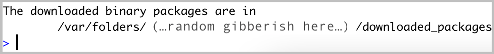
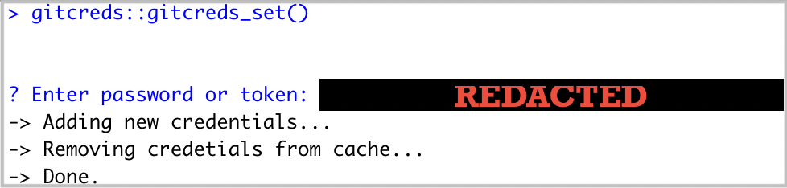

#### 1. Install or update R

To install R, visit [cloud.r-project.org](https://cloud.r-project.org/) to download the most recent version for your operating system. You should have *at least* version 4.3.1 (released 2023-06-16) running when you start MEDS.

#### 2. Install or update RStudio

While R is a programming language, RStudio is a software (often referred to as an IDE, **I**ntegrated **D**evelopment **E**nvironment) that provides R programmers with a neat, easy-to-use interface for coding in R. There are a number of IDEs out there, but RStudio is arguably the best and definitely most popular among R programmers.

**Note:** RStudio will not work without R installed, and you won't particularly enjoy using R without having RStudio installed. Be sure to install *both*!

```{r, echo = FALSE, fig.align="center", fig.cap = "Image Credit: Manny Gimond | Accessible at https://mgimond.github.io/ES218/R_vs_RStudio.html"}
knitr::include_graphics("img/install-guide-images/R_RStudio.png")
```

- **New install:** To install RStudio, visit [rstudio.com/products/rstudio/](https://www.rstudio.com/products/rstudio/). Download the free (“Open Source Edition”) Desktop version for your operating system. You should install the most up-to-date version available that is supported by your operating system.

- **Update:** If you already have RStudio and need to update: Open RStudio, and under ‘Help’ in the top menu, choose ‘Check for updates.’ If you have the most recent release, it will return ‘No update available. You are running the most recent version of RStudio.’ Otherwise, you should follow the instructions to install an updated version.

- Open RStudio (logo you'll click on shown below). **If you are prompted to install Command Line Tools, do it.**

```{r, echo = FALSE, fig.out="25%", fig.align="center"}
knitr::include_graphics("img/install-guide-images/rstudio-logo.png")
```

#### 3. Install Quarto 

Quarto is a scientific publishing tool built on Pandoc that allows R, Python, Julia, and ObservableJS users to create dynamic documents, websites, books and more.  

Quarto is now included with RStudio v2022.07.1+ **so no need for a separate download/install** if you have the latest version of RStudio! You can find all releases (current, pre, and older releases) on the Quarto website [download page](https://quarto.org/docs/download/), should you want/need to reference them.

#### 4. Check for git

You should already have git on your device, but let’s check for it anyway. 

- Open RStudio  

- In the Terminal, run the following command:

```{bash eval=FALSE}
where git
```

- If after running that you get something that looks like a file path to git on your computer, then you have git installed. For example, that might return something like this (or it could differ a bit): `/usr/local/bin/git`. If you instead get no response at all, you should download & install git from here: [git-scm.com/downloads](https://git-scm.com/downloads)

<center><span style="color: #003660; font-size:20px;">**An aside:** We'll be using git *a lot* throughout MEDS. GitHub's [Git Guides](https://github.com/git-guides) are a really wonderful resource to refer to!</span></center>


#### 5. Create a GitHub account 

- If you don’t already have a GitHub account, go to github.com and create one. Here are helpful considerations for choosing a username: [happygitwithr.com/github-acct.html](https://happygitwithr.com/github-acct.html). We suggest that you **do not** use your *@ucsb.edu email* when setting up your account, as that email will be deactivated soon after graduating. Instead, a *personal email* or your *@bren.ucsb.edu* email is best.

#### 6. Configure git

- In RStudio, open the Terminal. Run the following commands (by pressing Enter after each line), replacing the username (keep the quotation marks!) and email with your username and email used for your GitHub account. 

```{bash eval=FALSE}
git config --global user.name "Jane Doe"
git config --global user.email janedoe@example.com
```

- Then, in the Terminal run the following, carefully checking that the name and email returned match your GitHub information: 

```{bash eval=FALSE}
git config --list --global
```

#### 7. Store your GitHub personal access token (PAT)

**First:** What even is a personal access token? From GitHub's documentation:

> Personal access tokens (PATs) are an alternative to using passwords for authentication to GitHub when using the [GitHub API](https://docs.github.com/en/rest/overview/other-authentication-methods#via-oauth-and-personal-access-tokens) or the [command line](https://docs.github.com/en/authentication/keeping-your-account-and-data-secure/creating-a-personal-access-token#using-a-token-on-the-command-line).

This means that in order to push your work (files, scripts, etc.) from your laptop (or any other computer) to GitHub, you'll need to first to generate a PAT. **Importantly, you'll need to generate a PAT for each computer you wish to work from.** For example, we will complete the following steps to create a PAT for your personal laptop, but you'll also need to create a PAT if/when you choose to work on any of the Bren servers. Good news is that you can follow these same steps when you're ready to set up additional PATs on other machines. For now, let's get a PAT for our personal laptop squared away:  

- Once you have git configured successfully, install the `usethis` package in R by running the following in the RStudio Console: 

```{r eval=FALSE}
install.packages(“usethis”)
```

A lot of scary looking red text will show up while this is installing - don’t panic. If you get to the end and see something like below (with no error) it’s installed successfully. 

```{r, echo = FALSE, fig.out="60%", fig.align="center"}

```

- Run the following in the RStudio Console: 

```{r eval=FALSE}
usethis::create_github_token() 
```
     
- Enter your GitHub password when prompted. You’ll be taken to a screen that looks like this:

```{r, echo = FALSE, fig.out="60%", fig.align="center"}

```

- In the **Note** field, you should see some autopopulated text: `R:GITHUB_PAT`. We suggest changing this to something that signifies what machine it's being used for. For example, if you are generating a PAT for your laptop, you might choose to rename it, `my_laptop`.

- Next, you'll see a section called **Select scopes** with reasonable options already selected for you. Do not change anything. Just scroll down to the bottom of that page and click the green ‘Generate token’ button:

```{r, echo = FALSE, fig.out="80%", fig.align="center"}

```

- Copy the generated PAT to your clipboard

- Back in RStudio, in the console run: 

```{r eval=FALSE}
gitcreds::gitcreds_set()
```

This will prompt you to paste the PAT you just copied from GitHub. Paste the PAT, press Enter to run. You should see something like this show up if all is well so far (you’ll have pasted your PAT where mine says “REDACTED”): 

```{r, echo = FALSE, fig.out="40%", fig.align="center"}

```

- In the RStudio Console, run: 

```{r eval=FALSE}
usethis::git_sitrep()
```

Does it return information about your connected GitHub account that looks something like below? Great! You’ve configured git and successfully stored your PAT. 

```{r, echo = FALSE, fig.out="50%", fig.align="center"}

```

**A note on expiring tokens:** Setting an expiration date on personal access tokens is highly recommended in order to keep your information secure. GitHub will send you an email when it's time to renew a token that's about to expire. When it does, follow the same steps above to regenerate your token.

<span style="color: #003660; font-size:20px;">**ATTENTION:** If you're setting your PAT for a Bren server (e.g. Taylor or Tsosie), you must also run the following in the Terminal: 

```{bash eval=FALSE}
git config --global credential.helper 'cache --timeout=10000000'
```

<span style="color: #003660; font-size:20px;">If you *do not*, your PAT will be removed from the server's memory and you'll have to reset your PAT (over and over and over again, even if your PAT has not expired on GitHub):</span>

#### 8. Install Anaconda

- [Click here to download 64-bit Graphical Installer](https://repo.anaconda.com/archive/Anaconda3-2021.05-Windows-x86_64.exe). This might pop open a new tab with a “redirecting you to…” phrase, but Anaconda should be downloading at the same time. It might take a couple minutes. After it’s downloaded, click it and hit Allow if you see the following:

```{r, echo = FALSE, fig.out="20%", fig.align="center"}
knitr::include_graphics("img/install-guide-images/allow-program.png")
```

Follow the installation steps to complete Anaconda installation.

#### 9. Install Cyberduck

Cyberduck is a program that allows you to browse files on a remote server. Download [here](https://cyberduck.io/).

#### 10. Install UCSB's Pulse Secure Campus VPN (Virtual Private Network)

For secure remote access to the UCSB's campus network when you're not physically present on campus, you'll need to download and install the Pulse Secure VPN client. This will allow you to access UCSB's technology resources (including servers, journal subscriptions, etc.) anytime and from anywhere.

See this [Bren Zendesk article](https://www.ets.ucsb.edu/network-infrastructure-services/pulse-secure-campus-vpn) for directions on how to get started.

#### 11. Create your Slack account and join MEDS 

- Click [here](https://join.slack.com/t/ucsb-meds/shared_invite/zt-so8oh7xf-w41bSnbBWAiMOXKPf5j_qw) to join our UCSB-MEDS Slack Workspace

- Customize your profile with your name and photo.

- Join the summer course channels (#eds-212, #eds-221, #eds-214)

- Read through the [Slack Resource Guide](https://ucsb-meds.github.io/meds-slack.html)

#### 12. Access Google apps through your ucsb.edu account

Once enrolled and your UCSBnetID is activated, you will have access to your [UCSB Connect Account](https://www.connect.ucsb.edu/usage) which provides email, calendaring, and collaboration services. *You must use this account (UCSBnetID@ucsb.edu) to log in and access all of your Google Apps (including Google Calendar, Google Drive, etc.).*
  
The [**MEDS Google Calendar**](https://calendar.google.com/calendar/u/0/embed?src=c_1886ai526iqschc9mnpj6cu753n60@resource.calendar.google.com&ctz=America/Los_Angeles) contains all classes and events relevant for our MEDS students. Feel free to add this to your calendar if you find it helpful. To do so, log in to [Google Calendar](https://www.google.com/calendar) using your @ucsb.edu credentials > Click on the `+` next to "Other calendars" on the left-hand side of your screen and choose "Browse resources" > Click the drop down arrow next to "bren" and check the box next to "bren-calendar-meds"

### End MEDS Installation Guide
