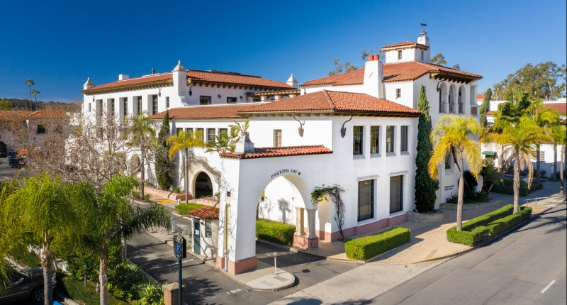

```{r, echo = FALSE, out.width = "100%", fig.align = 'center', fig.alt="The NCEAS building, located at 1021 Anacapa St. in downtown Santa Barbara."}

```

All students are subject to NCEAS’ [Code of Conduct](https://live-ncea-ucsb-edu-v01.pantheonsite.io/sites/default/files/2020-02/NCEAS_Code-of-Conduct_2019.pdf) while at NCEAS.

### Bikes
Do not bring your bike inside the building. All bikes must be kept outside of the building. There are a couple bike parking spots along Anacapa, and a couple in the covered parking garage at our building.

### Skateboards 
Skateboards are permitted in the first floor as long as they are not ridden inside. They must be laid flat on the ground, not against walls to avoid marking up the walls.

### Kitchen
MEDS students may use the first floor kitchen. This kitchen is also shared with NCEAS. Please be respectful and keep the kitchen clean. This includes washing your dishes, drying and putting them away. Do not leave dishes in the sink. The refrigerator is a shared space that must be kept clean and smell-free. Kitchen privileges can and will be revoked at any time if policies are not followed. 

**Students are only permitted to store food to be consumed that day in the fridge. No alcoholic beverages or long-term storage is allowed.**

Each month we assign 2 students to do a refrigerator clean out, removing food that has expired and empty forgotten containers. This is assigned during summer session.

### After hours access
Students are currently able to access and use the NCEAS first floor space after hours and on weekends. Instructions on how to do so will be provided during orientation.

### Whiteboards
Please erase and clean all whiteboards after use and leave markers in their designated spot.

### Pets 
Pets are not allowed. UCSB Campus does not permit dogs in buildings except for service dogs. 

### Third Floor
The building’s third floor is home to many of the NCEAS staff and scientists, as well as our conference rooms and outdoor terrace. The conference rooms are not for student use. If you need private group meeting space, you can reserve the first floor room (#105).

The terrace has an occupancy limit of just 49 people. This unfortunately limits the access we can provide our MEDS students to invited events only.

### Room Reservations

The Sequoia Room (first floor, NCEAS #150) may be reserved via the Bren Scheduling system. Please visit **booking.bren.ucsb.edu** and sign in using your UCSBnetID credentials. For more information, check out this [Bren zendesk article](https://bren.zendesk.com/hc/en-us/articles/4407675987092-Bren-Scheduling-System-Instructions-RobinPowered-).

```{r, echo = FALSE, out.width = "100%", fig.align = 'center', fig.alt="The Sequoia Room, which includes a meeting table that seats 7 people, a large computer monitor, and whiteboard."}
knitr::include_graphics("img/sequoia_room.jpg")
```

