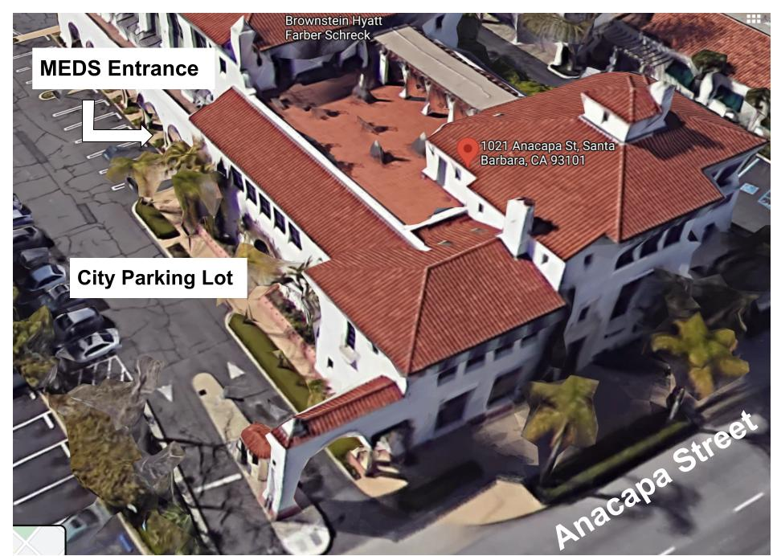

## What is NCEAS?

The [National Center for Ecological Analysis and Synthesis](https://www.nceas.ucsb.edu/) (NCEAS) is an independent research affiliate of the University of California, Santa Barbara, established in 1995 as the first synthesis science center in the world. Importantly, it's also a home base (along with the Bren School) for students during their time in the MEDS program. Read more [about NCEAS](https://www.nceas.ucsb.edu/about), its [people](https://www.nceas.ucsb.edu/about-us/our-people), and the [latest news](https://www.nceas.ucsb.edu/news) -- and be sure to pop up to the 3rd floor terrace for lunch and mingling with NCEAS researchers and staff during your time here!

<br>

```{r, echo = FALSE, out.width = "80%", fig.align = 'center', fig.alt="The NCEAS logo -- on the left is an abstract green monarch butterfly, which pays homage to the Lorenz attractor (a butterfly pattern created by the computation of mathematical equations that are part of chaos theory). On the right are the letters 'NCEAS' in red, atop a horizontal yellow line. Beneath the yellow line are the words 'National Center for Ecological Analysis and Synthesis in smaller black lettering."}

```

## Getting to NCEAS

### Finding us

NCEAS is located at 1021 Anacapa St. and occupies the 1st and 3rd floors of the building. MEDS students will primarily use the 1st floor space, which includes the classroom, co-working spaces, a reservable meeting room, and more. Find the building entrance off Santa Barbara City Lot #8:

```{r, echo = FALSE, out.width = "100%", fig.align = 'center', fig.alt="The NCEAS building, located at 1021 Anacapa St. in downtown Santa Barbara."}

```

### Parking

There is a city lot ([Lot 8](https://www.google.com/maps/place/City+of+Santa+Barbara+Downtown+Parking+Lot+%238/@34.4229813,-119.7039768,17z/data=!3m1!4b1!4m6!3m5!1s0x80e9153598183b1f:0x89c0e3f26a29a394!8m2!3d34.4229813!4d-119.7014019!16s%2Fg%2F11ns2hn1mb?entry=ttu)) attached to the building. It is free for the first 75 minutes and $3.00 per hour after that. Most people opt to find free street parking a few blocks away -- just make sure to look for street sweeping restrictions.

There is limited bike parking available in the parking garage, accessed from Lot 8.

### Bus

If you live in on-campus housing, or in Isla Vista, the Santa Barbara [MTD 24X line](https://sbmtd.gov/routes/route-24x/) is the most efficient bus route between NCEAS and the University. Hop on at the closest stop to your home, and get off at the transit center on Carillo and Chapala, which is just 2 blocks from NCEAS. **Be sure to check the schedule so you arrive before Orientation and classes begin.**
 
If you have any questions, we can be reached at academics@bren.ucsb.edu.

## NCEAS Building Policies

All students are subject to NCEAS’ [Code of Conduct](https://live-ncea-ucsb-edu-v01.pantheonsite.io/sites/default/files/2020-02/NCEAS_Code-of-Conduct_2019.pdf) while at NCEAS.

### Bikes
Do not bring your bike inside the building. All bikes must be kept outside of the building. There are a couple bike parking spots along Anacapa, and a few in the covered parking garage at our building.

### Skateboards 
Skateboards are permitted in the first floor as long as they are not ridden inside. They must be laid flat on the ground, not against walls to avoid marking up the walls.

### Kitchen
MEDS students may use the first floor kitchen. This kitchen is also shared with NCEAS. Please be respectful and keep the kitchen clean. This includes washing your dishes, drying and putting them away. Do not leave dishes in the sink. The refrigerator is a shared space that must be kept clean and smell-free. Kitchen privileges can and will be revoked at any time if policies are not followed. 

**Students are only permitted to store food to be consumed that day in the fridge. No alcoholic beverages or long-term storage is allowed.**

### After hours access
Students are currently able to access and use the NCEAS first floor space after hours and on weekends. Instructions on how to do so will be provided during orientation.

### Whiteboards
Please erase and clean all whiteboards after use and leave markers in their designated spot.

### Pets 
Pets are not allowed. UCSB Campus does not permit dogs in buildings except for service dogs. 

### Third Floor
The building’s third floor is home to many of the NCEAS staff and scientists, as well as our conference rooms and outdoor terrace. The conference rooms are not for student use.

The terrace has an occupancy limit of just 49 people. This unfortunately limits the access we can provide our MEDS students to invited events only.

### Room Reservations

The Sequoia Room (first floor, NCEAS #150) may be reserved via the Bren Scheduling system. Please visit **booking.bren.ucsb.edu** and sign in using your UCSBnetID credentials. For more information, check out this [Bren zendesk article](https://bren.zendesk.com/hc/en-us/articles/4407675987092-Bren-Scheduling-System-Instructions-RobinPowered-).

```{r, echo = FALSE, out.width = "100%", fig.align = 'center', fig.alt="The Sequoia Room, which includes a meeting table that seats 7 people, a large computer monitor, and whiteboard."}
knitr::include_graphics("img/sequoia_room.jpg")
```

